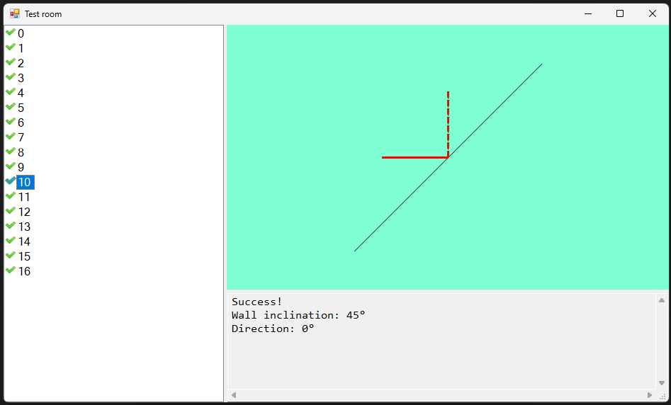

# Платформа: ulearn
## Курс: Основы программирования
### Тема: 1 Ошибки
#### Практика «Бильярд»
##### Решено 12 сентября 2022 в 09:15

Реалиован метод для расчета угла отскока шарика от стены. Считаем, что угол падения равен углу отражения, то есть можно пренебречь всеми физическими эффектами, связанными с кручением шаров, трением шара об стенку и т.п.

